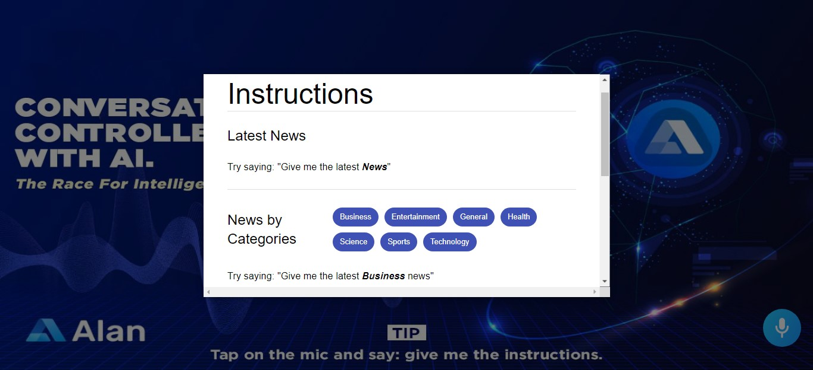
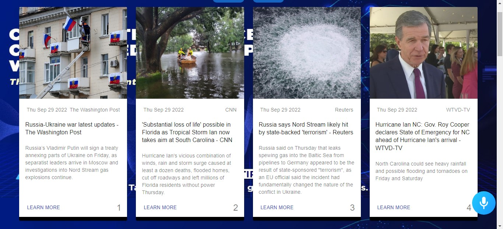

# News App with Alan AI

## Overview

News App with AI is a React-based web application that leverages the Alan AI SDK to provide a voice-controlled news reading experience. The app fetches news articles and displays them as interactive cards, allowing users to browse, read, and open articles using voice commands. Features include an introductory video on the homepage, a modal with instructions for voice commands, and a responsive grid layout for news articles.

This project is ideal for developers, news enthusiasts, or anyone interested in exploring voice-controlled applications using AI. It demonstrates the integration of React with the Alan AI SDK for a seamless user experience.

## Features

**Voice-Controlled Interaction** – Use voice commands to browse news, open specific articles, and access instructions.

**Interactive News Cards** – Articles are presented in a visually engaging, responsive grid layout.

**Introductory Video** – A welcome video plays on the homepage for a smooth user onboarding experience.

**Instructional Modal** – Built-in modal offers a quick guide on supported voice commands.

**Mobile-Responsive Design** – Built using Material-UI for a seamless experience across devices.

**Article Highlighting** – Actively highlights the currently focused article based on voice input.

## Prerequisites

Before running the app, ensure you have:

- Node.js (v14 or later) and npm
- Git for cloning the repo
- An Alan AI Account with an active API key
- Basic familiarity with React

## Getting Started

### 1. Clone the Repository

```bash
git clone https://github.com/addobentil/News-App-with-AI.git
cd News-App-with-AI
```

### 2. Install Dependencies

```bash
npm install
```

Key dependencies include:

- react: For building the user interface.
- @alan-ai/alan-sdk-web: For voice control functionality.
- @material-ui/core: For UI components and styling.
- words-to-numbers: For parsing spoken numbers in voice commands.
- use-sound: For playing sound effects.
- classnames: For conditional class names in components.

### 3. Set Up Alan AI

1. Create a project on [Alan AI Studio](https://studio.alan.app/)
2. Copy your API key
3. Create a `.env` file at the root of the project and add:

```env
API_KEY=your_alan_ai_api_key_here
```

💡 **Tip:** Never hardcode API keys in your codebase. Use environment variables for security.

### 4. Start the App

```bash
npm start
```

The app will run locally at `http://localhost:3000`

## Usage Guide

### Running the App

After running `npm start`, the app will load in your browser.

- The homepage displays an introductory video with sound.
- After the intro, the app transitions to the main interface, where you can interact with "Instructions" to open a modal with voice command examples.

### Voice Commands

The app uses the Alan AI SDK to enable voice-controlled navigation. Here are the supported voice commands:

- **Fetch News**: "Give me the latest news" or "newHeadlines" to fetch and display news articles.
- **Open Instructions**: "Instructions" to open a modal with voice command examples.
- **Highlight Articles**: "Highlight" to read article highlights.
- **Open Article**: "Open article number [number]" (e.g., "Open article number 5") to open the specified article in a new tab.
- **Go Back**: "Go back" to return to the previous state.
- **Respond to Highlights Prompt**: After fetching news, the app asks "Would you like me to read the highlights?". You can respond with **"Yes"** or **"No"**.

### Main Interface

#### Homepage with Introductory Video

- On first load, the app displays an introductory video.

## Screenshots


- After the video, the app transitions to the Homepage.

## Screenshots


#### Instruction Modal

- Open the instruction modal by saying "Instructions".
- The modal provides examples of voice commands for fetching news by categories, terms, and sources.
- Categories include Business, Entertainment, General, Health, Science, Sports, and Technology.
- Sources include CNN, Wired, BBC News, Time, IGN, Buzzfeed, and ABC News.

## Screenshots



## Example Usage

### Fetching News with Voice Commands

1. Say: "Give me the latest news".
2. The app fetches news articles and displays them as cards.
3. After fetching news, the app asks if you'd like it to read the highlights.
   - Say: **"Yes"** to begin auto-reading.
     - The app starts from the first article, highlights it with a yellow bottom color, and scrolls automatically.
   - Say: **"No"** to skip reading.

#### News Cards

- Once articles are fetched, they are displayed in a responsive grid layout.
- Each card shows the article's title, description, source, publication date, and image.
- The **first news card is always the active article** and is not controlled by voice commands.
- After fetching news, the app prompts the user to confirm if they want it to read the highlights.
  - If the user says **"Yes"**, the app begins reading from the first article.
  - While reading, the active article is indicated with a **yellow bottom color**.
  - The app automatically scrolls to each article as it reads.

## Screenshots




### Opening an Article

- Say: "Open article number 3".
- The app opens the third article in a new browser tab.

### Viewing Instructions

- Say: "Instructions".
- The instruction modal opens, showing examples of voice commands.
